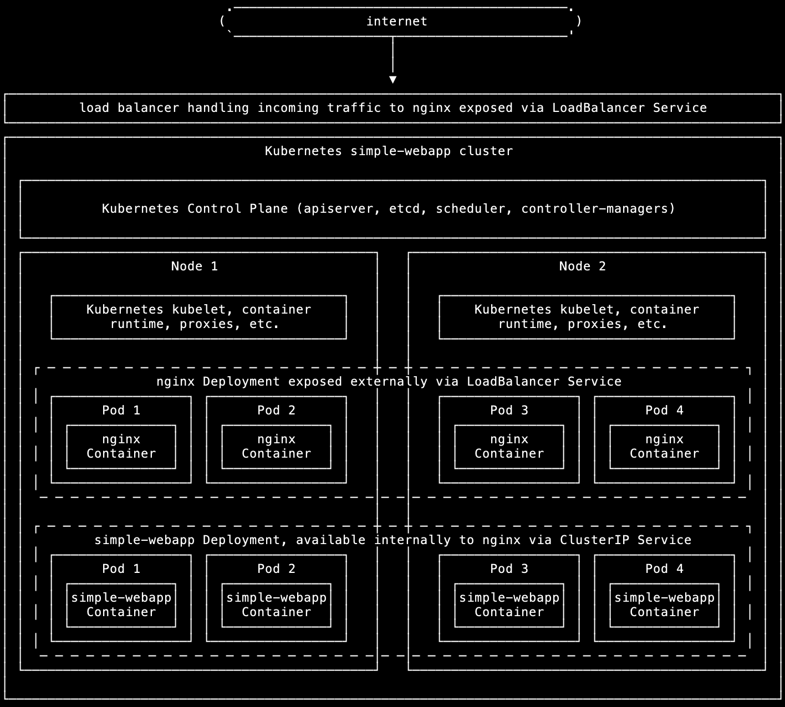
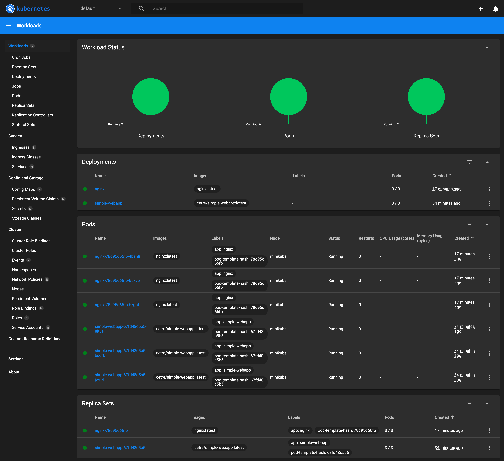
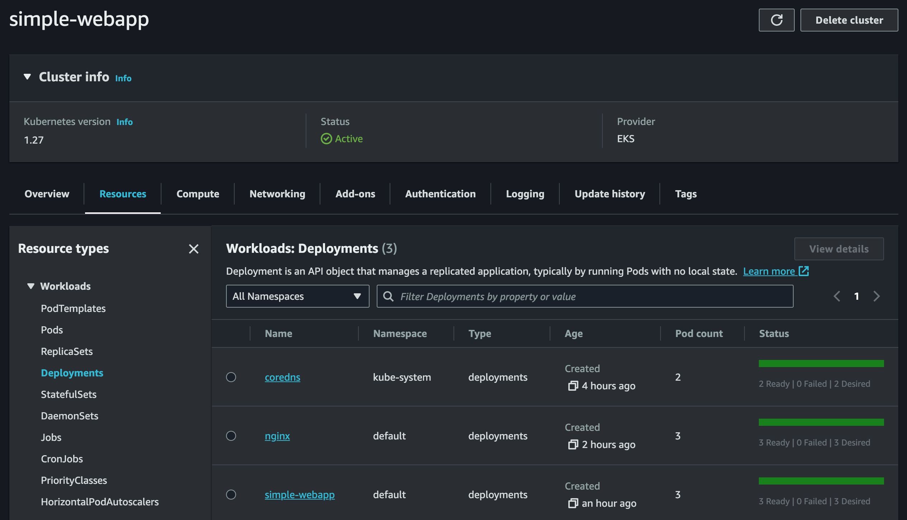
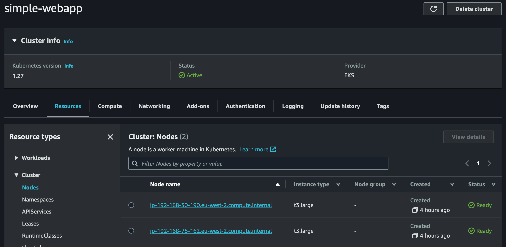

# How to set up a Kubernetes cluster with minikube and then with Amazon EKS

## Purpose of this tutorial

Our goal is to create a Kubernetes cluster serving the output of _simple-webapp_ via nginx. _simple-webapp_ is a simple Python app I wrote for these kinds of projects, which outputs a basic web page as proof of concept. In a real production environment, this would be a full-blown web application of some kind.

The Kubernetes cluster will consist of the following:

* Two cluster Nodes.
* A _simple-webapp_ Deployment consisting of four Pods, each running the _simple-webapp_ container, exposed internally to nginx via a ClusterIP Service.
* An nginx Deployment consisting of four Pods, each running an nginx container with a modified _nginx.conf_ file made available via a ConfigMap which allows nginx to reverse-proxy traffic to the _simple-webapp_ service, exposed externally via a LoadBalancer Service.

This will be done in two stages:

1. Firstly we'll set up a development cluster on our local machine using minikube. 
1. Then we'll build the cluster on Amazon EKS, which could be used for test and/or production environments. This will use two EC2 instances for the cluster Nodes, plus an ELB for the load balancer.

## Requirements

* [Docker](https://www.docker.com/)
* [kubectl](https://kubernetes.io/docs/reference/kubectl/)
* [minikube](https://minikube.sigs.k8s.io/)
* [AWS CLI](https://aws.amazon.com/cli/)
* [eksctl](https://eksctl.io/)
* An account on [Amazon Web Services](https://aws.amazon.com/)

Get Docker from [here](https://docs.docker.com/get-docker/).

To install the rest in Homebrew on macOS:

    brew install kubectl minikube awscli eksctl

## AWS CLI setup

Configure credentials and config for AWS CLI as per the [official documentation](https://docs.aws.amazon.com/cli/latest/userguide/cli-chap-configure.html). Make absolutely sure you are using the correct AWS account/profile before you begin, in a safe test environment completely isolated from any production systems or other important infrastructure, otherwise you could potentially break something important.

## Build _simple-webapp_ container image

Ensure Docker is running.

Build the _simple-webapp_ container image and push it to your own repo as per my instructions [here](https://github.com/mattbrock/simple-webapp). Alternatively, avoid this step by using my _cetre/simple-webapp_ repo on Docker Hub, though I can't necessarily guarantee this image will contain the most recent version.

## Local cluster with minikube

### Start Kubernetes cluster

Ensure Docker is running (since minikube uses a Docker container for the cluster) then start minikube:

    minikube start
    
You should see the following:

    $ minikube start
	😄  minikube v1.31.2 on Darwin 13.4.1 (arm64)
	✨  Automatically selected the docker driver
	📌  Using Docker Desktop driver with root privileges
	👍  Starting control plane node minikube in cluster minikube
	🚜  Pulling base image ...
	🔥  Creating docker container (CPUs=2, Memory=4000MB) ...
	🐳  Preparing Kubernetes v1.27.4 on Docker 24.0.4 ...
	    ▪ Generating certificates and keys ...
	    ▪ Booting up control plane ...
	    ▪ Configuring RBAC rules ...
	🔗  Configuring bridge CNI (Container Networking Interface) ...
	🔎  Verifying Kubernetes components...
	    ▪ Using image gcr.io/k8s-minikube/storage-provisioner:v5
	🌟  Enabled addons: storage-provisioner, default-storageclass
	🏄  Done! kubectl is now configured to use "minikube" cluster and "default" namespace by default

Verify that kubectl can access the cluster:

	$ kubectl get pod -A
	NAMESPACE     NAME                               READY   STATUS    RESTARTS       AGE
	kube-system   coredns-5d78c9869d-9b979           1/1     Running   0              6m11s
	kube-system   etcd-minikube                      1/1     Running   0              6m26s
	kube-system   kube-apiserver-minikube            1/1     Running   0              6m26s
	kube-system   kube-controller-manager-minikube   1/1     Running   0              6m27s
	kube-system   kube-proxy-zgz4z                   1/1     Running   0              6m11s
	kube-system   kube-scheduler-minikube            1/1     Running   0              6m26s
	kube-system   storage-provisioner                1/1     Running   1 (6m7s ago)   6m25s

### Create Deployment and Service for _simple-webapp_	
The Kubernetes Deployment for _simple-webapp_ is in the file _simple-webapp-deployment.yml_:

    apiVersion: apps/v1
    kind: Deployment
    metadata:
      name: simple-webapp
    spec:
      replicas: 4
      selector:
        matchLabels:
          app: simple-webapp
      template:
        metadata:
          labels:
            app: simple-webapp
        spec:
          containers:
            - name: simple-webapp
              image: cetre/simple-webapp:latest
              imagePullPolicy: IfNotPresent
              resources:
                limits:
                  memory: "128M"
                  cpu: "100m"
              ports:
                - containerPort: 8080

This creates four Pods, each running the _cetre/simple-webapp_ Container with tight limits on memory and CPU usage, and the Container port set to 8080.
	
If you've pushed the _simple-webapp_ image to your own Docker Hub repository, change the Docker Hub repository _cetre/simple-webapp_ to your own repository.

Create the _simple-webapp_ Deployment:

	$ kubectl apply -f simple-webapp-deployment.yml 
	deployment.apps/simple-webapp created

A Kubernetes Services is required to expose the _simple-webapp_ Deployment on an internal IP and port, so that nginx will be able to talk to it. The Service for _simple-webapp_ is defined in the file _simple-webapp-service.yml_:

    apiVersion: v1
    kind: Service
    metadata:
      name: simple-webapp-svc
      labels:
        name: simple-webapp-svc
    spec:
      ports:
        - port: 8080
          targetPort: 8080
          protocol: TCP
      selector:
        app: simple-webapp
      type: ClusterIP
      
This creates a ClusterIP Service to expose port 8080 from the Container internally within the cluster on port 8080.

Create the _simple-webapp_ Service:

	$ kubectl apply -f simple-webapp-service.yml 
	service/simple-webapp-svc created

Check the _simple-webapp_ Deployment and Service are running:

	$ kubectl get deployment simple-webapp
    NAME            READY   UP-TO-DATE   AVAILABLE   AGE
	simple-webapp   3/3     3            3           3m5s
	
	$ kubectl get service simple-webapp-svc
	NAME                TYPE        CLUSTER-IP       EXTERNAL-IP   PORT(S)    AGE
	simple-webapp-svc   ClusterIP   10.105.121.100   <none>        8080/TCP   3m48s
	
Forward a port to the Service to check it responds:

	$ kubectl port-forward service/simple-webapp-svc 8080:8080
	Forwarding from 127.0.0.1:8080 -> 8080
	Forwarding from [::1]:8080 -> 8080
	
Check the result in your web browser at `http://localhost:8080`. Type CTRL-C to stop port-forwarding.

Check the logs to confirm the request:

	$ kubectl logs -l app=simple-webapp
	127.0.0.1 - - [22/Aug/2023 07:10:27] "GET / HTTP/1.1" 200 -

### Create ConfigMap, Deployment and Service for nginx

A Kubernetes ConfigMap is used for the nginx configuration file _nginx.conf_ so that this can easily be changed within the ConfigMap configuration without having to build, push and redeploy new containers whenever the config is changed. The configuration defines a reverse proxy to pass requests to the _simple-webapp_ Service. 

The ConfigMap is defined in the _nginx-config.yml_ file:

    apiVersion: v1
    kind: ConfigMap
    metadata:
      name: nginx-config
    data:
      nginx.conf: |
    
        user  nginx;
        worker_processes  auto;
        
        error_log  /var/log/nginx/error.log notice;
        pid        /var/run/nginx.pid;
        
        
        events {
            worker_connections  1024;
        }
        
        
        http {
            include       /etc/nginx/mime.types;
            default_type  application/octet-stream;
        
            log_format  main  '$remote_addr - $remote_user [$time_local] "$request" '
                              '$status $body_bytes_sent "$http_referer" '
                              '"$http_user_agent" "$http_x_forwarded_for"';
        
            access_log  /var/log/nginx/access.log  main;
        
            sendfile        on;
            #tcp_nopush     on;
        
            keepalive_timeout  65;
        
            #gzip  on;
        
            server {
        
                listen 8000;
        
                location / {
                    proxy_pass http://simple-webapp-svc:8080;
                    proxy_set_header Host $http_host;
                    proxy_set_header X-Real-IP $remote_addr;
                    proxy_set_header X-Forwarded-For $proxy_add_x_forwarded_for;
                    proxy_set_header X-Forwarded-Proto $scheme;
                }
        
            }
        
            include /etc/nginx/conf.d/*.conf;
        }

Create the ConfigMap:

	$ kubectl apply -f nginx-config.yml
	configmap/nginx-config created

The nginx Deployment is defined in the _nginx-deployment.yml_ file:

    apiVersion: apps/v1
    kind: Deployment
    metadata:
      name: nginx
    spec:
      replicas: 4
      selector:
        matchLabels:
          app: nginx
      template:
        metadata:
          labels:
            app: nginx
        spec:
          containers:
            - name: nginx
              image: nginx:latest
              imagePullPolicy: IfNotPresent
              resources:
                limits:
                  memory: "128M"
                  cpu: "100m"
              ports:
                - containerPort: 8000
              volumeMounts:
              - name: nginx-config
                mountPath: /etc/nginx/nginx.conf
                subPath: nginx.conf
                readOnly: true
          volumes:
          - name: nginx-config
            configMap:
              name: nginx-config
              items:
              - key: nginx.conf
                path: nginx.conf
	
This creates four Pods, each running the nginx Container with tight limits on memory and CPU usage, and the Container port set to 8000, which is the port nginx is listening on. It also mounts the nginx-config ConfigMap to _/etc/nginx/nginx.conf_.

The nginx Service is defined in the _nginx-service.yml_ file:

    apiVersion: v1
    kind: Service
    metadata:
      name: nginx-svc
      labels:
        name: nginx-svc
    spec:
      ports:
        - port: 8000
          targetPort: 8000
          protocol: TCP
      selector:
        app: nginx
      type: LoadBalancer	
	
This creates a LoadBalancer Service to expose port 8000 from the Containers externally on port 8000 via a load balancer.

Check the nginx ConfigMap, Deployment and Service are running:

    $ kubectl get configmap nginx-config
    NAME           DATA   AGE
    nginx-config   1      7m29s

	$ kubectl get deployment nginx
	NAME    READY   UP-TO-DATE   AVAILABLE   AGE
	nginx   3/3     3            3           7m34s
	
	$ kubectl get service nginx-svc
	NAME        TYPE           CLUSTER-IP      EXTERNAL-IP   PORT(S)          AGE
	nginx-svc   LoadBalancer   10.110.39.225   <pending>     8000:32689/TCP   7m49s

The LoadBalancer external IP shows as "pending" because minikube isn't able to launch an actual load balancer for the LoadBalancer Service, so in this development environment we can check this by creating a tunnel to the LoadBalancer Service. Do this in a separate Terminal tab:

    $ minikube tunnel
	✅  Tunnel successfully started
	
	📌  NOTE: Please do not close this terminal as this process must stay alive for the tunnel to be accessible ...
	
	🏃  Starting tunnel for service nginx-svc.
	
In main tab, check the Service again, and it should now have an external IP (localhost):

	$ kubectl get service nginx-svc
	NAME        TYPE           CLUSTER-IP      EXTERNAL-IP   PORT(S)          AGE
	nginx-svc   LoadBalancer   10.110.39.225   127.0.0.1     8000:32689/TCP   10m

Check this in your web browser at `http://127.0.0.1:8000`, then check the logs to see the request:

	$ kubectl logs -l app=nginx
	10.244.0.1 - - [22/Aug/2023:07:31:37 +0000] "GET / HTTP/1.1" 200 418 "-" "Mozilla/5.0 (Macintosh; Intel Mac OS X 10_15_7) AppleWebKit/537.36 (KHTML, like Gecko) Chrome/116.0.0.0 Safari/537.36" "-"

### minikube dashboard

In a separate tab, open the minikube dashboard:

	$ minikube dashboard
	🔌  Enabling dashboard ...
	    ▪ Using image docker.io/kubernetesui/dashboard:v2.7.0
	    ▪ Using image docker.io/kubernetesui/metrics-scraper:v1.0.8
	💡  Some dashboard features require the metrics-server addon. To enable all features please run:
	
	        minikube addons enable metrics-server
	
	
	🤔  Verifying dashboard health ...
	🚀  Launching proxy ...
	🤔  Verifying proxy health ...
	🎉  Opening http://127.0.0.1:50809/api/v1/namespaces/kubernetes-dashboard/services/http:kubernetes-dashboard:/proxy/ in your default browser...

The dashboard should open in your web browser:

This provides a handy and nice-looking dashboard, making it easy to see exactly what's happening within all the cluster components.

### Delete minikube cluster

Once finished, delete the local minikube cluster:

	$ minikube delete
	🔥  Deleting "minikube" in docker ...
	🔥  Deleting container "minikube" ...
	🔥  Removing /Users/brock/.minikube/machines/minikube ...
	💀  Removed all traces of the "minikube" cluster.    

## Amazon EKS cluster with eksctl

Only proceed with this if you're absolutely sure you are using the correct AWS account/profile before you begin, in a safe test environment completely isolated from any production systems or other important infrastructure, otherwise you could potentially break something important.

### Create Kubernetes cluster in EKS

The _eks-cluster.yml_ file defines the configuration for eksctl to use to create the EKS cluster:

    apiVersion: eksctl.io/v1alpha5
    kind: ClusterConfig
    
    metadata:
      name: simple-webapp
      region: eu-west-2
      version: "1.27"
    
    nodeGroups:
      - name: simple-webapp-nodegroup
        instanceType: t3.large
        desiredCapacity: 2
        
This defines the name and the desired Kubernetes version, and creates a Node Group consisting of two Nodes. The Nodes are EC2 instances of type t3.large. 

If you're not using the eu-west-2 region, change it accordingly.

eksctl handles everything else automatically, including creation of VPC with subnets and routes, Security Groups, IAM permissions, etc. These details can be specified within the eksctl config file if desired.

Create the EKS cluster using the eksctl config file:

	$ eksctl create cluster -f eks-cluster.yml
	2023-08-22 14:54:07 [ℹ]  eksctl version 0.153.0-dev+a79b3826a.2023-08-18T10:03:46Z
	2023-08-22 14:54:07 [ℹ]  using region eu-west-2
	2023-08-22 14:54:07 [ℹ]  setting availability zones to [eu-west-2c eu-west-2a eu-west-2b]
	2023-08-22 14:54:07 [ℹ]  subnets for eu-west-2c - public:192.168.0.0/19 private:192.168.96.0/19
	2023-08-22 14:54:07 [ℹ]  subnets for eu-west-2a - public:192.168.32.0/19 private:192.168.128.0/19
	2023-08-22 14:54:07 [ℹ]  subnets for eu-west-2b - public:192.168.64.0/19 private:192.168.160.0/19
	2023-08-22 14:54:07 [ℹ]  nodegroup "simple-webapp-nodegroup" will use "ami-0f3589a95ffd274bf" [AmazonLinux2/1.27]
	2023-08-22 14:54:07 [ℹ]  using Kubernetes version 1.27
	2023-08-22 14:54:07 [ℹ]  creating EKS cluster "simple-webapp" in "eu-west-2" region with un-managed nodes
	2023-08-22 14:54:07 [ℹ]  1 nodegroup (simple-webapp-nodegroup) was included (based on the include/exclude rules)
	2023-08-22 14:54:07 [ℹ]  will create a CloudFormation stack for cluster itself and 1 nodegroup stack(s)
	2023-08-22 14:54:07 [ℹ]  will create a CloudFormation stack for cluster itself and 0 managed nodegroup stack(s)
	2023-08-22 14:54:07 [ℹ]  if you encounter any issues, check CloudFormation console or try 'eksctl utils describe-stacks --region=eu-west-2 --cluster=simple-webapp'
	2023-08-22 14:54:07 [ℹ]  Kubernetes API endpoint access will use default of {publicAccess=true, privateAccess=false} for cluster "simple-webapp" in "eu-west-2"
	2023-08-22 14:54:07 [ℹ]  CloudWatch logging will not be enabled for cluster "simple-webapp" in "eu-west-2"
	2023-08-22 14:54:07 [ℹ]  you can enable it with 'eksctl utils update-cluster-logging --enable-types={SPECIFY-YOUR-LOG-TYPES-HERE (e.g. all)} --region=eu-west-2 --cluster=simple-webapp'
	2023-08-22 14:54:07 [ℹ]  
	2 sequential tasks: { create cluster control plane "simple-webapp", 
	    2 sequential sub-tasks: { 
	        wait for control plane to become ready,
	        create nodegroup "simple-webapp-nodegroup",
	    } 
	}
	2023-08-22 14:54:07 [ℹ]  building cluster stack "eksctl-simple-webapp-cluster"
	2023-08-22 14:54:07 [ℹ]  deploying stack "eksctl-simple-webapp-cluster"
	2023-08-22 14:54:37 [ℹ]  waiting for CloudFormation stack "eksctl-simple-webapp-cluster"
	2023-08-22 14:55:08 [ℹ]  waiting for CloudFormation stack "eksctl-simple-webapp-cluster"
	2023-08-22 14:56:08 [ℹ]  waiting for CloudFormation stack "eksctl-simple-webapp-cluster"
	2023-08-22 14:57:08 [ℹ]  waiting for CloudFormation stack "eksctl-simple-webapp-cluster"
	2023-08-22 14:58:08 [ℹ]  waiting for CloudFormation stack "eksctl-simple-webapp-cluster"
	2023-08-22 14:59:08 [ℹ]  waiting for CloudFormation stack "eksctl-simple-webapp-cluster"
	2023-08-22 15:00:08 [ℹ]  waiting for CloudFormation stack "eksctl-simple-webapp-cluster"
	2023-08-22 15:01:08 [ℹ]  waiting for CloudFormation stack "eksctl-simple-webapp-cluster"
	2023-08-22 15:02:08 [ℹ]  waiting for CloudFormation stack "eksctl-simple-webapp-cluster"
	2023-08-22 15:04:09 [ℹ]  building nodegroup stack "eksctl-simple-webapp-nodegroup-simple-webapp-nodegroup"
	2023-08-22 15:04:09 [ℹ]  --nodes-min=2 was set automatically for nodegroup simple-webapp-nodegroup
	2023-08-22 15:04:09 [ℹ]  --nodes-max=2 was set automatically for nodegroup simple-webapp-nodegroup
	2023-08-22 15:04:10 [ℹ]  deploying stack "eksctl-simple-webapp-nodegroup-simple-webapp-nodegroup"
	2023-08-22 15:04:10 [ℹ]  waiting for CloudFormation stack "eksctl-simple-webapp-nodegroup-simple-webapp-nodegroup"
	2023-08-22 15:04:40 [ℹ]  waiting for CloudFormation stack "eksctl-simple-webapp-nodegroup-simple-webapp-nodegroup"
	2023-08-22 15:05:18 [ℹ]  waiting for CloudFormation stack "eksctl-simple-webapp-nodegroup-simple-webapp-nodegroup"
	2023-08-22 15:06:14 [ℹ]  waiting for CloudFormation stack "eksctl-simple-webapp-nodegroup-simple-webapp-nodegroup"
	2023-08-22 15:07:23 [ℹ]  waiting for CloudFormation stack "eksctl-simple-webapp-nodegroup-simple-webapp-nodegroup"
	2023-08-22 15:07:23 [ℹ]  waiting for the control plane to become ready
	2023-08-22 15:07:23 [✔]  saved kubeconfig as "/Users/brock/.kube/config"
	2023-08-22 15:07:23 [ℹ]  no tasks
	2023-08-22 15:07:23 [✔]  all EKS cluster resources for "simple-webapp" have been created
	2023-08-22 15:07:23 [ℹ]  adding identity "arn:aws:iam::318951153566:role/eksctl-simple-webapp-nodegroup-si-NodeInstanceRole-WKJIY951Q1WZ" to auth ConfigMap
	2023-08-22 15:07:23 [ℹ]  nodegroup "simple-webapp-nodegroup" has 0 node(s)
	2023-08-22 15:07:23 [ℹ]  waiting for at least 2 node(s) to become ready in "simple-webapp-nodegroup"
	2023-08-22 15:07:51 [ℹ]  nodegroup "simple-webapp-nodegroup" has 2 node(s)
	2023-08-22 15:07:51 [ℹ]  node "ip-192-168-23-36.eu-west-2.compute.internal" is ready
	2023-08-22 15:07:51 [ℹ]  node "ip-192-168-82-170.eu-west-2.compute.internal" is ready
	2023-08-22 15:07:51 [✖]  parsing kubectl version string  (upstream error: ) / "0.0.0": Version string empty
	2023-08-22 15:07:51 [ℹ]  cluster should be functional despite missing (or misconfigured) client binaries
	2023-08-22 15:07:51 [✔]  EKS cluster "simple-webapp" in "eu-west-2" region is ready
	
These lines seem to suggest a problem in setting up the config for kubectl, but I didn't experience any problems using kubectl with the EKS cluster, so it seems to just be a verification bug:

	2023-08-22 15:07:51 [✖]  parsing kubectl version string  (upstream error: ) / "0.0.0": Version string empty
	2023-08-22 15:07:51 [ℹ]  cluster should be functional despite missing (or misconfigured) client binaries

Verify that kubectl can access the new EKS cluster:

	$ kubectl get pods -A
	NAMESPACE     NAME                      READY   STATUS    RESTARTS   AGE
	kube-system   aws-node-9kh9c            1/1     Running   0          6m37s
	kube-system   aws-node-nxpjf            1/1     Running   0          6m33s
	kube-system   coredns-8b48879c8-xjp9k   1/1     Running   0          14m
	kube-system   coredns-8b48879c8-zxmml   1/1     Running   0          14m
	kube-system   kube-proxy-rqscq          1/1     Running   0          6m37s
	kube-system   kube-proxy-w5wbk          1/1     Running   0          6m33s

### Create Deployments, Services and ConfigMap for _simple-webapp_ and nginx

Create _simple-webapp_ Deployment and Service:

	$ kubectl apply -f simple-webapp-deployment.yml 
	deployment.apps/simple-webapp created
	
	$ kubectl apply -f simple-webapp-service.yml 
	service/simple-webapp-svc created

Check they're running:

	$ kubectl get deployment simple-webapp
	NAME            READY   UP-TO-DATE   AVAILABLE   AGE
	simple-webapp   3/3     3            3           46s
	
	$ kubectl get service simple-webapp-svc
	NAME                TYPE        CLUSTER-IP     EXTERNAL-IP   PORT(S)    AGE
	simple-webapp-svc   ClusterIP   10.100.64.16   <none>        8080/TCP   57s
		
Create nginx ConfigMap, Deployment and Service:

	$ kubectl apply -f nginx-config.yml
	configmap/nginx-config created
	
	$ kubectl apply -f nginx-deployment.yml
	deployment.apps/nginx created
	
	$ kubectl apply -f nginx-service.yml 
	service/nginx-svc created

Check they're running:

    $ kubectl get configmap nginx-config
    NAME           DATA   AGE
    nginx-config   1      80s

	$ kubectl get deployment nginx
	NAME    READY   UP-TO-DATE   AVAILABLE   AGE
	nginx   3/3     3            3           91s
	
	$ kubectl get service nginx-svc
	NAME        TYPE           CLUSTER-IP      EXTERNAL-IP                                                              PORT(S)          AGE
	nginx-svc   LoadBalancer   10.100.51.154   a7ddfba7461144ebbb6ad2be87dc9127-897879486.eu-west-2.elb.amazonaws.com   8000:31815/TCP   96s
	
It should now be possible to check the web app in a browser using the following URL, changing the domain to the one you've received from EKS in the EXTERNAL-IP column, but retaining port 8000 at the end:

`http://a7ddfba7461144ebbb6ad2be87dc9127-897879486.eu-west-2.elb.amazonaws.com:8000`

(It may take a couple of minutes before this responds, whilst the ELB is provisioned.)

Check the front-end (nginx Deployment) and back-end (_simple-webapp_ Deployment) logs to see that the requests came in:

    $ kubectl logs -l app=nginx
    192.168.82.170 - - [22/Aug/2023:14:28:28 +0000] "GET / HTTP/1.1" 200 418 "-" "Mozilla/5.0 (Macintosh; Intel Mac OS X 10_15_7) AppleWebKit/537.36 (KHTML, like Gecko) Chrome/116.0.0.0 Safari/537.36" "-"
    
    $ kubectl logs -l app=simple-webapp
    192.168.79.249 - - [22/Aug/2023 14:28:28] "GET / HTTP/1.0" 200 -

The web-based EKS Management Console isn't as pretty as the minikube dashboard, and oddly it seems to have some missing information (I couldn't find the nginx ConfigMap in there, for example) but is still useful for obtaining information. For example, we can see our Deployments, Services and Nodes:

It's also possible to see the provisioned EC2 instances used as Kubernetes Nodes, and the provisioned ELB used as the load balancer, in the EC2 Management Console.

### Delete EKS cluster

Once finished, delete the cluster (include waiting for the CloudFormation stack to finish), making absolutely sure you're using the correct account/profile and deleting the correct cluster:

	$ eksctl delete cluster -f eks-cluster.yml --wait
	2023-08-22 14:45:20 [ℹ]  deleting EKS cluster "simple-webapp"
	2023-08-22 14:45:21 [ℹ]  will drain 1 unmanaged nodegroup(s) in cluster "simple-webapp"
	2023-08-22 14:45:21 [ℹ]  starting parallel draining, max in-flight of 1
	2023-08-22 14:45:21 [ℹ]  cordon node "ip-192-168-30-190.eu-west-2.compute.internal"
	2023-08-22 14:45:21 [ℹ]  cordon node "ip-192-168-78-162.eu-west-2.compute.internal"
	2023-08-22 14:46:43 [✔]  drained all nodes: [ip-192-168-30-190.eu-west-2.compute.internal ip-192-168-78-162.eu-west-2.compute.internal]
	2023-08-22 14:46:43 [ℹ]  deleted 0 Fargate profile(s)
	2023-08-22 14:46:44 [✔]  kubeconfig has been updated
	2023-08-22 14:46:44 [ℹ]  cleaning up AWS load balancers created by Kubernetes objects of Kind Service or Ingress
	2023-08-22 14:47:09 [ℹ]  
	2 sequential tasks: { delete nodegroup "simple-webapp-nodegroup", delete cluster control plane "simple-webapp" 
	}
	2023-08-22 14:47:10 [ℹ]  will delete stack "eksctl-simple-webapp-nodegroup-simple-webapp-nodegroup"
	2023-08-22 14:47:10 [ℹ]  waiting for stack "eksctl-simple-webapp-nodegroup-simple-webapp-nodegroup" to get deleted
	2023-08-22 14:47:10 [ℹ]  waiting for CloudFormation stack "eksctl-simple-webapp-nodegroup-simple-webapp-nodegroup"
	2023-08-22 14:47:40 [ℹ]  waiting for CloudFormation stack "eksctl-simple-webapp-nodegroup-simple-webapp-nodegroup"
	2023-08-22 14:48:38 [ℹ]  waiting for CloudFormation stack "eksctl-simple-webapp-nodegroup-simple-webapp-nodegroup"
	2023-08-22 14:49:21 [ℹ]  waiting for CloudFormation stack "eksctl-simple-webapp-nodegroup-simple-webapp-nodegroup"
	2023-08-22 14:49:22 [ℹ]  will delete stack "eksctl-simple-webapp-cluster"
	2023-08-22 14:49:22 [ℹ]  waiting for stack "eksctl-simple-webapp-cluster" to get deleted
	2023-08-22 14:49:22 [ℹ]  waiting for CloudFormation stack "eksctl-simple-webapp-cluster"
	2023-08-22 14:49:52 [ℹ]  waiting for CloudFormation stack "eksctl-simple-webapp-cluster"
	2023-08-22 14:50:33 [ℹ]  waiting for CloudFormation stack "eksctl-simple-webapp-cluster"
	2023-08-22 14:52:14 [ℹ]  waiting for CloudFormation stack "eksctl-simple-webapp-cluster"
	2023-08-22 14:52:14 [✔]  all cluster resources were deleted

### Working on an existing EKS cluster from a different local machine

When wishing to administer the cluster from a different local machine, do this to update the minikube config for the running EKS cluster:

    eksctl utils write-kubeconfig -c simple-webapp