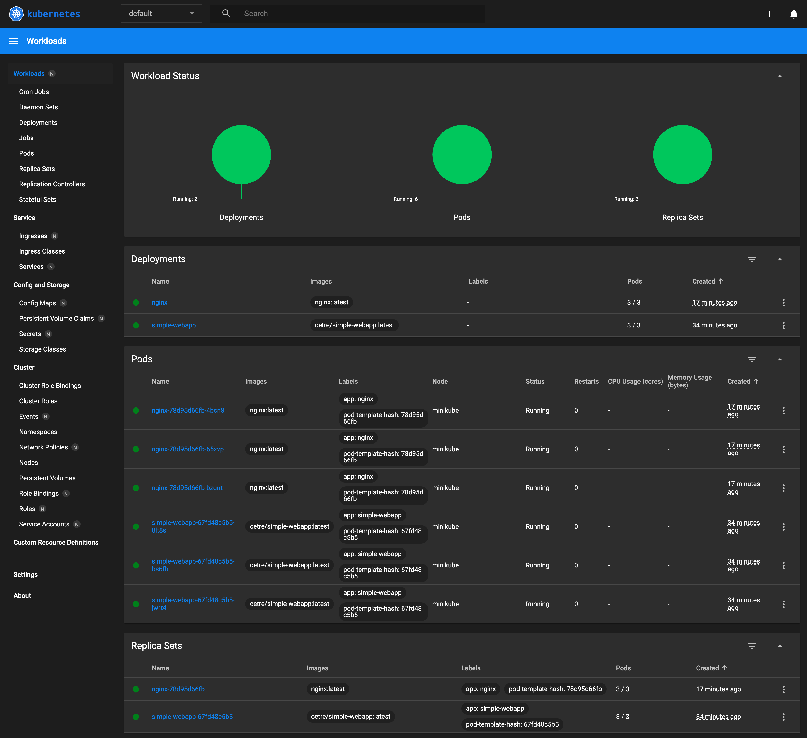

# Kubernetes cluster delivery, first with minikube, then with Amazon EKS

## Goal

[todo]

## Requirements

* [Docker](https://www.docker.com/)
* [kubectl](https://kubernetes.io/docs/reference/kubectl/)
* [minikube](https://minikube.sigs.k8s.io/)
* AWS CLI
* [eksctl](https://eksctl.io/)

Get Docker from [here](https://docs.docker.com/get-docker/).

To install the rest in Homebrew on macOS:

    brew install kubectl minikube eksctl

## AWS CLI setup

[todo]

## Build _simple-webapp_ container image

Ensure Docker is running.

Build the _simple-webapp_ container image and push it to your own repo as per my instructions [here](https://github.com/mattbrock/simple-webapp). Alternatively, avoid this step by using my _cetre/simple-webapp_ repo on Docker Hub, though I can't necessarily guarantee this image will contain the most recent version.

## Local cluster with minikube

Ensure Docker is running.

Start minikube:

    minikube start
    
Should see the following:

    $ minikube start
	😄  minikube v1.31.2 on Darwin 13.4.1 (arm64)
	✨  Automatically selected the docker driver
	📌  Using Docker Desktop driver with root privileges
	👍  Starting control plane node minikube in cluster minikube
	🚜  Pulling base image ...
	🔥  Creating docker container (CPUs=2, Memory=4000MB) ...
	🐳  Preparing Kubernetes v1.27.4 on Docker 24.0.4 ...
	    ▪ Generating certificates and keys ...
	    ▪ Booting up control plane ...
	    ▪ Configuring RBAC rules ...
	🔗  Configuring bridge CNI (Container Networking Interface) ...
	🔎  Verifying Kubernetes components...
	    ▪ Using image gcr.io/k8s-minikube/storage-provisioner:v5
	🌟  Enabled addons: storage-provisioner, default-storageclass
	🏄  Done! kubectl is now configured to use "minikube" cluster and "default" namespace by default

Verify that kubectl can access the cluster:

	$ kubectl get pod -A
	NAMESPACE     NAME                               READY   STATUS    RESTARTS       AGE
	kube-system   coredns-5d78c9869d-9b979           1/1     Running   0              6m11s
	kube-system   etcd-minikube                      1/1     Running   0              6m26s
	kube-system   kube-apiserver-minikube            1/1     Running   0              6m26s
	kube-system   kube-controller-manager-minikube   1/1     Running   0              6m27s
	kube-system   kube-proxy-zgz4z                   1/1     Running   0              6m11s
	kube-system   kube-scheduler-minikube            1/1     Running   0              6m26s
	kube-system   storage-provisioner                1/1     Running   1 (6m7s ago)   6m25s
	
Change Docker repo in these files if necessary.

Do SW deployment then service and check it works:

	$ kubectl apply -f simple-webapp-deployment.yml 
	deployment.apps/simple-webapp created
	
	$ kubectl apply -f simple-webapp-service.yml 
	service/simple-webapp-svc created

	$ kubectl get deployment simple-webapp
	NAME            READY   UP-TO-DATE   AVAILABLE   AGE
	simple-webapp   3/3     3            3           3m5s
	
	$ kubectl get service simple-webapp-svc
	NAME                TYPE        CLUSTER-IP       EXTERNAL-IP   PORT(S)    AGE
	simple-webapp-svc   ClusterIP   10.105.121.100   <none>        8080/TCP   3m48s
	
Port forward to service to check it responds:

	$ kubectl port-forward service/simple-webapp-svc 8080:8080
	Forwarding from 127.0.0.1:8080 -> 8080
	Forwarding from [::1]:8080 -> 8080
	
Check in web browser `http://localhost:8080`. CTRL-C to stop port-forwarding.

Check logs:

	$ kubectl logs -l app=simple-webapp
	127.0.0.1 - - [22/Aug/2023 07:10:27] "GET / HTTP/1.1" 200 -
	
Do nginx config map, deployment and service then check:

	$ kubectl apply -f nginx-config.yml
	configmap/nginx-config created
	$ kubectl apply -f nginx-deployment.yml
	deployment.apps/nginx created
	$ kubectl apply -f nginx-service.yml 
	service/nginx-svc created

Check:

	$ kubectl get deployment nginx
	NAME    READY   UP-TO-DATE   AVAILABLE   AGE
	nginx   3/3     3            3           7m34s
	
	$ kubectl get service nginx-svc
	NAME        TYPE           CLUSTER-IP      EXTERNAL-IP   PORT(S)          AGE
	nginx-svc   LoadBalancer   10.110.39.225   <pending>     8000:32689/TCP   7m49s

LB IP shows as "pending". In a separate tab, create a tunnel to the LB:

    $ minikube tunnel
	✅  Tunnel successfully started
	
	📌  NOTE: Please do not close this terminal as this process must stay alive for the tunnel to be accessible ...
	
	🏃  Starting tunnel for service nginx-svc.
	
In main tab, check service again, it now has an external IP (localhost):

	$ kubectl get service nginx-svc
	NAME        TYPE           CLUSTER-IP      EXTERNAL-IP   PORT(S)          AGE
	nginx-svc   LoadBalancer   10.110.39.225   127.0.0.1     8000:32689/TCP   10m

IP now assigned. Check in web browser `http://localhost:8000` then check logs:

	$ kubectl logs -l app=nginx
	10.244.0.1 - - [22/Aug/2023:07:31:37 +0000] "GET / HTTP/1.1" 200 418 "-" "Mozilla/5.0 (Macintosh; Intel Mac OS X 10_15_7) AppleWebKit/537.36 (KHTML, like Gecko) Chrome/116.0.0.0 Safari/537.36" "-"

In a separate tab, open the minikube dashboard:

	$ minikube dashboard
	🔌  Enabling dashboard ...
	    ▪ Using image docker.io/kubernetesui/dashboard:v2.7.0
	    ▪ Using image docker.io/kubernetesui/metrics-scraper:v1.0.8
	💡  Some dashboard features require the metrics-server addon. To enable all features please run:
	
	        minikube addons enable metrics-server
	
	
	🤔  Verifying dashboard health ...
	🚀  Launching proxy ...
	🤔  Verifying proxy health ...
	🎉  Opening http://127.0.0.1:50809/api/v1/namespaces/kubernetes-dashboard/services/http:kubernetes-dashboard:/proxy/ in your default browser...

The dashboard should open in your web browser:

Destroy local cluster in minikube:

    minikube delete
    
## Amazon EKS

	eksctl create cluster -f eks-cluster.yml
	eksctl delete cluster -f eks-cluster.yml --wait

a
